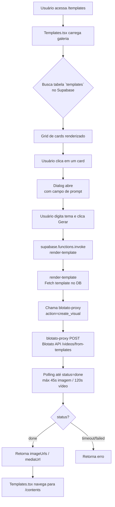

# Fluxo de Templates — TrendPulse

Documentação do sistema de templates da galeria self-serve. Cobre o fluxo completo de ponta a ponta, a estrutura do banco, como adicionar novos templates e como a engine Blotato funciona.

---

## Diagrama do Fluxo End-to-End



**Versão ASCII simplificada:**
```
/templates
    └─ Templates.tsx
         ├─ Fetch DB → grid de cards
         ├─ Clique → Dialog com prompt
         └─ Gerar → invoke render-template
                        └─ Fetch DB (template)
                        └─ blotato-proxy (create_visual)
                              └─ Blotato API
                              └─ Poll status
                        └─ { imageUrls, mediaUrl }
```

---

## Componentes do Fluxo

### `src/pages/Templates.tsx`

Página única que combina galeria, seleção e geração. Não existe TemplateGallery/TemplateForm separados — tudo está inline aqui.

**O que faz:**
- No mount, faz `SELECT` na tabela `templates` filtrando `is_active = true`, ordenando por `sort_order`.
- Renderiza um grid responsivo (2-4 colunas) de botões. Cada card exibe o ícone da categoria, nome, descrição truncada e badge (FREE/PRO/VIDEO/NEW).
- Ao clicar num card, abre um `Dialog` com campo de `Textarea` para o usuário digitar o tema/instrução.
- Ao submeter, chama `supabase.functions.invoke("render-template", { body: { templateId, prompt } })`.
- Se `data.status === "done"`, navega para `/contents` onde o conteúdo gerado aparece.

**Tipos relevantes** (`src/pages/Templates.tsx:19`):
```typescript
interface Template {
  id: string;
  name: string;
  description: string | null;
  blotato_template_key: string;
  category: string;       // infographic | video | social | quote
  badge: string | null;   // FREE | PRO | VIDEO | NEW
  is_free: boolean;
  sort_order: number;
  aspect_ratio: string;   // 1:1 | 9:16
}
```

---

### `supabase/functions/render-template/index.ts`

Edge function que orquestra a geração. É o ponto de entrada do backend para o fluxo de templates.

**Recebe:** `{ templateId: string, prompt: string, inputs?: object }`

**Faz:**
1. Valida o JWT do usuário (header `Authorization`).
2. Busca o template no banco pelo `templateId` — retorna `blotato_template_key`, `name`, `category`, `aspect_ratio`.
3. Chama `blotato-proxy` via fetch interno (usando `SUPABASE_SERVICE_ROLE_KEY`) com `action: "create_visual"`.
4. Repassa a resposta do proxy para o cliente, enriquecida com `templateKey`, `templateName`, `category`, `aspectRatio`.

**Não salva nada no banco** — isso fica a cargo de trabalho futuro (a integração com `generated_contents` ainda não está implementada aqui).

---

### `supabase/functions/blotato-proxy/index.ts`

Proxy que encapsula toda a comunicação com a API Blotato. É chamado apenas internamente por `render-template` (nunca diretamente do frontend).

**Ações suportadas:**
- `list_templates` — lista templates disponíveis na API Blotato (utilitário).
- `create_visual` — cria um visual e aguarda a conclusão via polling.

**Registry de templates** (`blotato-proxy/index.ts:20`):
```typescript
const TEMPLATES: Record<string, string> = {
  "tweet-minimal":            "/base/v2/tweet-card/ba413be6.../v1",
  "quote-mono":               "/base/v2/quote-card/77f65d2b.../v1",
  "infographic-newspaper":    "07a5b5c5-387c-...",  // UUID direto
  "video-story":              "/base/v2/ai-story-video/5903fe43.../v1",
  // ... etc
}
```

Existem dois formatos de ID na API Blotato:
- **Path-based** (`/base/v2/<tipo>/<uuid>/v1`) — templates de texto/layout (tweet, quote, tutorial, carrossel). Chamam endpoints REST fixos.
- **UUID puro** — templates com geração por IA (infográficos, product placement). Podem consumir créditos Blotato.

**Polling:**
Após criar o visual, a função faz polling no endpoint `/videos/creations/{id}` a cada 2,5s. Timeout: 45s para imagens, 120s para vídeos. Retorna `{ status, imageUrls, mediaUrl }`.

---

## Tabela `templates` no Banco de Dados

```sql
CREATE TABLE public.templates (
  id                   uuid PRIMARY KEY DEFAULT gen_random_uuid(),
  name                 text NOT NULL,
  description          text,
  blotato_template_key text NOT NULL UNIQUE, -- chave amigável usada no TEMPLATES registry
  blotato_template_id  text NOT NULL,        -- path ou UUID direto da API Blotato
  category             text NOT NULL DEFAULT 'infographic',
  badge                text,                 -- FREE | PRO | VIDEO | NEW
  is_free              boolean NOT NULL DEFAULT false,
  sort_order           integer NOT NULL DEFAULT 0,
  aspect_ratio         text NOT NULL DEFAULT '1:1',
  is_active            boolean NOT NULL DEFAULT true,
  created_at           timestamptz DEFAULT now()
);
```

**RLS:** Qualquer usuário autenticado pode ler templates onde `is_active = true`.

**Categorias e badges:**

| category | Ícone no UI | Uso |
|---|---|---|
| `social` | Sparkles | Tweet cards, tutoriais |
| `quote` | Image | Quote cards |
| `infographic` | FileText | Infográficos com IA |
| `video` | Play | Story/slideshow vídeos |

| badge | Custo |
|---|---|
| `FREE` | 0 créditos Blotato |
| `PRO` | Créditos Blotato (1–1250) |
| `VIDEO` | Créditos Blotato + tempo longo |
| `NEW` | Apenas visual |

---

## Como o Input Vira Conteúdo (sem `input_schema`)

O sistema atual usa um modelo de **prompt livre** — não há formulário dinâmico com campos tipados. O usuário digita um tema em linguagem natural e a API Blotato interpreta via IA.

O campo `inputs` existe no protocolo (aceito por `render-template` e `blotato-proxy`), mas a UI hoje não o usa: sempre envia `inputs: {}`. Isso significa que o Blotato usa o `prompt` como única instrução para compor o visual.

**Fluxo de dados do input:**
```
Textarea (prompt) → Templates.tsx
  → render-template: { templateId, prompt }
    → blotato-proxy: { action:"create_visual", templateKey, prompt, inputs:{} }
      → Blotato API: { templateId, prompt, inputs:{}, render:true }
```

Se no futuro templates precisarem de campos estruturados (ex: autor, frase, cor), o campo `inputs` já está no protocolo — basta a UI montá-lo e a tabela conter o schema correspondente.

---

## Como a Engine É Escolhida

Atualmente **a única engine é Blotato**. O campo `category` influencia o comportamento do polling (vídeos esperam 120s vs 45s para imagens), mas não muda a engine.

O `blotato-proxy` identifica templates de vídeo pela chave:
```typescript
const isVideoTemplate =
  templateKey?.startsWith("video-") ||
  templateId.includes("ai-story-video") ||
  templateId.includes("ai-selfie-video");
```

**Arquitetura planejada para múltiplas engines:**
O `render-template` pode no futuro desviar o fluxo baseado num campo `engine` na tabela:
- `blotato` → atual (Blotato API)
- `gemini` → geração de imagem via inference.sh (modelo já usado no fluxo de chat)
- `satori` → composição texto-sobre-imagem local (já existe `render-slide-image` para isso)

Hoje esse campo não existe na tabela. Para adicionar, ver seção abaixo.

---

## Passo a Passo: Adicionar um Novo Template

### 1. Registrar a chave no `blotato-proxy`

Abra `supabase/functions/blotato-proxy/index.ts` e adicione uma entrada no registry `TEMPLATES`:

```typescript
const TEMPLATES: Record<string, string> = {
  // ... templates existentes ...
  "meu-template-novo": "/base/v2/<tipo>/<uuid>/v1",  // ou UUID puro
};
```

A chave (`meu-template-novo`) é o `blotato_template_key` que vai no banco.

### 2. Inserir na tabela `templates`

Execute no Supabase SQL Editor (ou via migration):

```sql
INSERT INTO public.templates
  (name, description, blotato_template_key, blotato_template_id, category, badge, is_free, sort_order, aspect_ratio)
VALUES
  (
    'Nome do Template',
    'Descrição curta do visual gerado',
    'meu-template-novo',                        -- deve bater com o registry acima
    '/base/v2/<tipo>/<uuid>/v1',                -- path ou UUID da API Blotato
    'infographic',                              -- infographic | video | social | quote
    'PRO',                                      -- FREE | PRO | VIDEO | NEW
    false,                                      -- is_free
    11,                                         -- sort_order (próximo disponível)
    '1:1'                                       -- 1:1 ou 9:16
  );
```

### 3. Deployar a função atualizada

```bash
npx supabase functions deploy blotato-proxy --project-ref qdmhqxpazffmaxleyzxs
```

`render-template` não precisa de deploy se você só adicionou template (a lógica não mudou).

### 4. Verificar na galeria

Acesse `/templates` no app. O novo template deve aparecer na posição definida pelo `sort_order`. Clique nele, digite um prompt e clique **Gerar**.

### 5. Testar a geração

- Se `status === "done"` e você for redirecionado a `/contents` → funcionou.
- Se der erro 400 (`Unknown template`) → o `blotato_template_key` no banco não bate com a chave no registry.
- Se der timeout → o UUID/path do Blotato está errado ou o template demora mais que o polling permite.

### Checklist rápido

- [ ] Chave adicionada no `TEMPLATES` registry do `blotato-proxy`
- [ ] Linha inserida na tabela `templates` com `blotato_template_key` idêntico
- [ ] `blotato-proxy` deployado
- [ ] Template aparece na galeria (`is_active = true`, `sort_order` correto)
- [ ] Geração funciona end-to-end (redirecionamento para `/contents`)

---

## Rota e Navegação

```
/templates  →  src/pages/Templates.tsx
/contents   →  src/pages/Contents.tsx  (onde o resultado aparece após geração)
```

A rota está registrada em `src/App.tsx:55`:
```typescript
<Route path="/templates" element={<Templates />} />
```

---

## Referências Rápidas

| O quê | Onde |
|---|---|
| Página da galeria | `src/pages/Templates.tsx` |
| Edge function de orquestração | `supabase/functions/render-template/index.ts` |
| Proxy Blotato + registry de templates | `supabase/functions/blotato-proxy/index.ts` |
| Migration + seed inicial | `supabase/migrations/20260511_templates_blotato_seed.sql` |
| Deploy de funções | `npx supabase functions deploy <nome> --project-ref qdmhqxpazffmaxleyzxs` |
